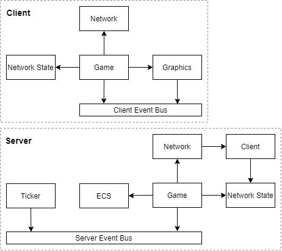

# Getting Started

## Prerequisites
 - JDK 16
 - Scala
 - Mill
 - Node

### MacOS
```
brew install java
brew install scala
brew install mill
```

### Windows with WSL2
It is recommended to use `sdkman` to install dependencies.
```
# Install SdkMan
curl -s "https://get.sdkman.io" | bash
source "$HOME/.sdkman/bin/sdkman-init.sh"

# Install SDKs
sdk install java 16-open
sdk install scala 2.13.5

# Install Mill
sudo sh -c "curl -L https://github.com/com-lihaoyi/mill/releases/download/0.9.7/0.9.7 > /usr/local/bin/mill && chmod +x /usr/local/bin/mill"

# Install Rendering Dependencies
sudo apt install ubuntu-desktop mesa-utils
```

On windows with WSL, `VcXsrv` will also have to be installed manually on the host.

It is recommended to use Visual Studio Code with the Scala Metals plugin. Metals can import the build file which will allow the dependencies to be resolved correctly.

If you are using IntelliJ Idea, it is required to run `npm run idea:reload` when any changes are made to the `build.sc` file. This will rebuild IntelliJ Idea files to ensure the editor resolves dependencies correctly.

## Development

### MacOS

On MacOS, mill can be run directly.

```
mill client.run
```

### Windows with WSL2

On Windows, if WSL is used, it is required to delegate rendering to the host display by connecting to an xserver running on the host. Once the xserver is running on the host, mill can be used normally after exporting the display variable.

First start the xserver on the host with `VcXsrv`, ensuring `Multiple windows` is selected, `Display number` is set to `0`, `Start no client` is chosen, `Native opengl` is unchecked and `Disable access control` is checked.

Then in WSL, run the following to set the `DISPLAY` environment variable.

```
export DISPLAY=$(grep nameserver /etc/resolv.conf | sed 's/nameserver //'):0
```

Mill can now be run normally and it should spawn a window on the host.

## Features



 - Client
   - Graphics
     - OpenGL 4 Context
     - Sprites
       - Ordered top to bottom, back to front
       - Static in World - 15,000 on screen - No world limit
       - Dynamic in World - 1,000 on screen - No world limit
       - Disable Sprites off screen (Culling) - QuadTree
     - Text
       - Updatable
     - Input
       - Keyboard
       - Mouse
     - Camera
       - Pan
   - Events
   - Network
   - Game
 - Server
 - Shared